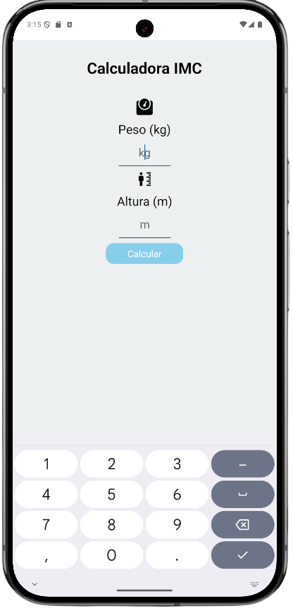
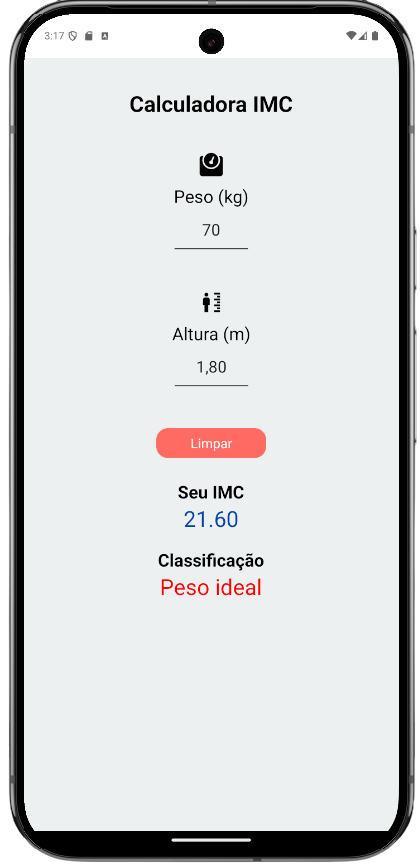

# 📱 Desenvolvimento de Aplicativo Híbrido com React Native e Expo 🚀  

<p align="center">
  
  &nbsp;&nbsp;&nbsp;&nbsp;&nbsp;&nbsp;&nbsp;&nbsp;&nbsp;&nbsp;&nbsp;&nbsp;&nbsp;&nbsp;&nbsp;&nbsp;&nbsp;&nbsp;&nbsp;&nbsp;&nbsp;&nbsp;&nbsp;&nbsp;&nbsp;&nbsp;&nbsp;&nbsp;&nbsp;&nbsp;&nbsp;&nbsp;&nbsp;&nbsp;&nbsp;&nbsp;&nbsp;&nbsp;&nbsp;&nbsp;&nbsp;&nbsp;&nbsp;&nbsp;&nbsp;&nbsp;&nbsp;&nbsp;
  
</p>
Este projeto foi desenvolvido com o apoio do curso da Plataforma +IFMG.  
O objetivo é implementar uma aplicação prática em **React Native**, compatível com dispositivos **Android** e **iOS**.

## ✨ Funcionalidades  

✅ **Aplicativo React Native**: Projeto desenvolvido utilizando React Native para as plataformas Android e iOS.  
✅ **Cálculo de IMC**: Realiza o cálculo do Índice de Massa Corporal (IMC) para informar a classificação do usuário.  
✅ **Interface Gráfica Intuitiva**: Exibe os resultados de forma clara e organizada.  
✅ **Exibição Detalhada**: Apresenta informações detalhadas do IMC, incluindo as categorias:  
- Abaixo do Peso  
- Peso Ideal  
- Sobrepeso  
- Obesidade Classe I  
- Obesidade Classe II  
- Obesidade Classe III  

## 🛠 Tecnologias Utilizadas  

- **React Native**  
- **Expo**  
- **Node.js**  

## 📥 Instalação  

Para executar a aplicação localmente, siga as etapas abaixo:

1. **Clone este repositório:**  
   ```bash
   git clone https://github.com/welderc/calculadora-imc-mobile
   ```
2. **Acesse o diretório do projeto:**
    ```bash
    cd calculadora-imc-mobile
    ```
3. **Instale as dependências:**
    ```bash
    npm install
    ```
    ou
    ```bash
    yarn install
    ``` 
4. **Inicie o projeto:**
    ```bash
    expo start
    ```
    ou
    ```bash
    npx expo start
    ```
Siga as instruções exibidas no terminal para visualizar o aplicativo em seu dispositivo ou emulador.

## 🚀 Tecnologias  
<p align="center">
   &nbsp;&nbsp;
   &nbsp;&nbsp;
   &nbsp;&nbsp;
   &nbsp;&nbsp;
  
</p>

## 🤝 **Contribuição**

Contribuições são sempre bem-vindas! Se deseja colaborar com este projeto, siga os passos abaixo:

1. **Fork** este repositório.
2. Crie uma **branch** para sua feature:
   ```bash
   git checkout -b minha-feature
    ```
3. **Faça os commits com suas alterações:**
    ```bash
    git commit -m "Adiciona nova funcionalidade"
    ```
4. **Envie sua branch para o repositório remoto**
    ```bash
    git push origin minha-feature
    ```
Abra um Pull Request com uma descrição clara das suas modificações.
